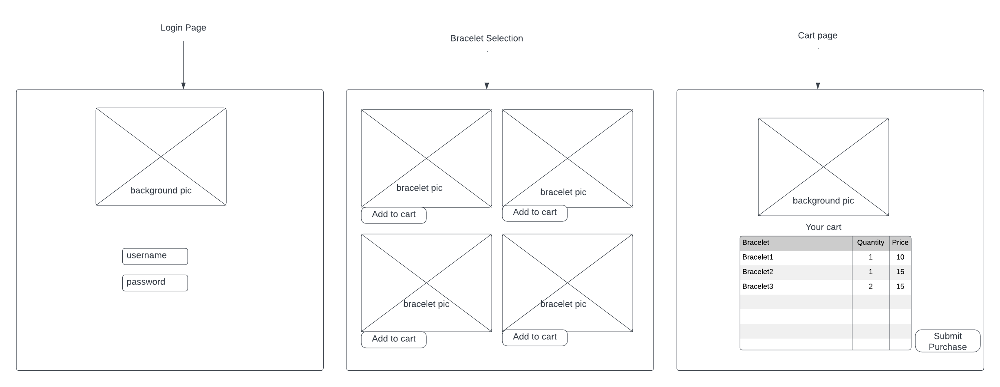

# Bracelets

## Description deliverable

### Elevator pitch

Since the ancient days, humans everywhere have adorned themselves with nice things. Jewelry is a key component and indicator of a greater cultural manifestation. My bracelet startup provides a way for people to express themselves in their daily lives. Starting with the website, and finishing with the bracelet on your wrist, this startup is made to provide a unique and personal experience to all. 

### Design

### Key features

- Secure login over HTTPS
- Ability to select the bracelet for purchase
- Display of bracelets (images)
- Totals from all users displayed in realtime
- Results are persistently stored

- **HTML** - Uses correct HTML structure for application. Three HTML pages. One for login, one for selecting a bracelet, one for the cart.
- **CSS** - Good styling for each page, even for different size screens. Asthetic color designs and schemes. 
- **JavaScript** - Manages login, choice display, choice selection, user cart display, backend endpoint calls.
- **Service** - Backend service with endpoints for:
  - login
  - retrieving bracelets
  - submitting selected bracelets
  - managing cart 
  (all of these functions can be found in the shop.js, and index.js files)
- **DB** - Store users, bracelets, and bracelets purchased in database.
- **Login** - Register and login users. Credentials securely stored in database. Bracelets will not be available without a valid credital.
- **WebSocket** - Amount of bracelets purchased is recorded to show "best selling" bracelet 
- **React** - Application ported to use the React web framework.

## HTML deliverable

- **HTML pages** - Three HTML pages to login, select bracelet(s), then database with eventual cart 
- **Links** - The login page automatically links to the selection page. The selection page has a few options of bracelets to select, then go to the cart page. 
- **Text** - Selection buttons for the bracelets are labeled. Eventually this will lead to the database.
- **Images** - One picture for each bracelet, as well as a picture on the cart and login screen. Pics will be loaded later, right now there are placeholders for them
- **Login** - Input box and submit button for login.
- **Database** - Bracelet data and sales will be stored and accessible from the database. Placeholders for now. 
- **WebSocket** - The count of puchases for each bracelet results represent the tally of realtime purchases.

## CSS deliverable

- **Header, footer, and main content body** - might come back later and change so of the formatting if there's a cooler way to do it. 
- **Navigation elements** - Elements are consistent across the website.
- **Responsive to window resizing** - My app looks great on all window sizes and devices.
- **Application elements** - Used good contrast and whitespace. Orgainzation is good, but I might make changes later if I find a better way of doing it. 
- **Application text content** - Consistent fonts, easy to read and follow.
- **Application images** - Images will be consistent and descriptive of the bracelets and company. I still need to take the bracelet pics, but the locations of the pics are all correct.

## JavaScript deliverable

Single user functionality.

- **login** - Logging in takes you to the "play" page, which I will change to the shop page later. The username is stored locally for now. 
- **database** - Dummy data is loaded into a table under the cart header (on the "scores" page.)
- **WebSocket** - I used the setInterval function to periodically increase a random bracelet count that a random user "bob" purchases. This will be replaced with WebSocket messages in the future. It can be found on top of the "play" page, but I will probably move this later to make it easier to look at. 
- **application logic** - Each time that the "purchase" button is clicked on the "play" page, the cart total will increase on the website header. This can be seen in real time on the play page. 

## Service deliverable

Backend to show best seller, as well as keep track of bracelets in cart.

- **Node.js/Express HTTP service** - created functions in shop.js and index.js 
- **Static middleware for frontend** - created functions in shop.js and index.js 
- **Backend service endpoints** - created functions in shop.js and index.js 
- **Frontend calls service endpoints** - created functions in shop.js and index.js  

cart keeps track of selected bracelet. (user clicks the purchase button and the corresponding bracelet is stored as an array in the index.js file called cartItems)
the images of the bracelets are no longer hard coded in, they are located in the shop.js file. 

## DB deliverable

Bracelet data to be stored in database

- **MongoDB Atlas database created** - database successfully created.
- **Endpoints for data** - to be done in the future.
- **Stores data in MongoDB** - to be done in the future.

## Login deliverable

Bracelet purchase associated to user's account

- **User registration** - Creates a new account in the database.
- **existing user** - Stores the votes under the same user if the user already exists.
- **Use MongoDB to store credentials** - Stores both user and their purchases.
- **Restricts functionality** - You cannot purchase until you have logged in.

## WebSocket deliverable

WebSocket to update the best selling bracelet on the frontend in realtime.

- **Backend listens for WebSocket connection** - to be done in the future.
- **Frontend makes WebSocket connection** - to be done in the future.
- **Data sent over WebSocket connection** - to be done in the future.
- **WebSocket data displayed** - Best selling bracelet to be displayed based off total purchases from users

## React deliverable

- **Bundled and transpiled** - to be done in the future.
- **Components** - Login, bracelet list, and cart are all components.
- **Router** - Routing between login and purchase components.
- **Hooks** - to be done in the future.
